# Artificial Intelligence Report
## Overview
This report is created for TAIST Artificial Intelligence Course taught by [Prof. Itsuo Kumazawa](http://t2r2.star.titech.ac.jp/cgi-bin/researcherinfo.cgi?lv=en&q_researcher_content_number=CTT100380875). The main topic is about the RNN. All [source code](code/) are related to tasks which described in this document.

**Basic notation table**

| Name | Description | Example |
| ---- | ----------- | ----- |
| a | Gain of the sigmoid function | 0.2, 0.5, 1, 5, 10 |
| Trials | Repeatedly execute the neuron with x rounds | 100, 1000, 10000 |
| Copies | Number of a copy of the RNN | 100, 1000, 10000 |
| RAND_MAX | Maximum range of a random generator for all tasks | RAND_MAX = 10000 |
| SEED | Seed of a random generator for all tasks | SEED = 0 |
| Input(x) | Input or initial state of a neuron | x = [1, 0, 1, -1, 0.5, -0.5] |
| State(x) | State of each neuron after updating | x = [1, 1, 0, 0, 1] |
| Convergent state(x) | State that the RNN stops changing the state. This situation will occurs when the RNN using a deterministic model only. | x = [1, 1, 0, 0, 1] |
| Weight(w) | Weight of a neuron | w = [1, -1, 2, -1, 2, -1] |
| Dummy | Threshold of a neuron which describe as w and x[0] = 1 | x[0] = 1, w[0][1] = 1 |

## **Task 1 - Simulation of Probabilistic Binary Model**

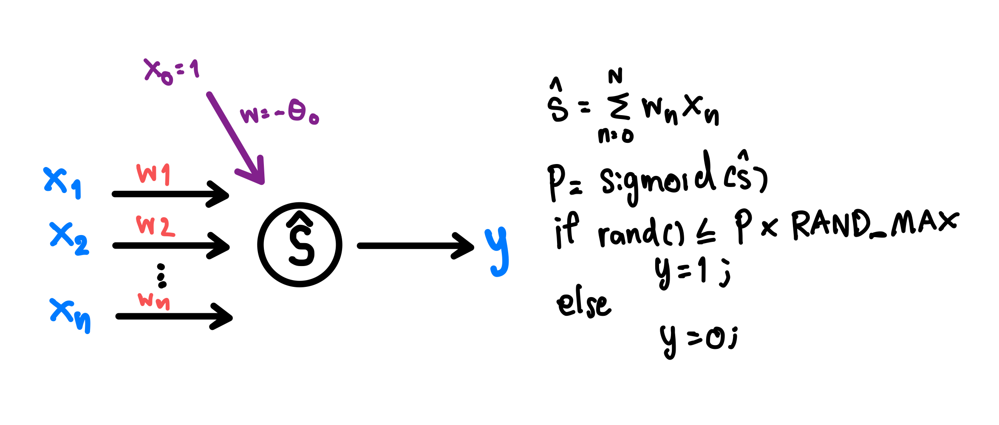 
[Source code](code/task1.py)  
Procedure  
1. Create a neuron which has 5 inputs with a probabilistic Binary Model (Using random generator to create probabilistic model).
1. Repeatedly execute the neuron with parameters defined in table.
1. Count when `y = 1` for the experimental result.
1. Calculate the theoretical result by ` Trials * P`.
1. Calculate a ⭐percent error(pe) between the experimental result and the theoretical result.
1. Calculate a ⭐average of percent error(mean) from each trail.
```py
# ⭐How to get percent error and average
# Percent error can be positive or negative to show more or less of result
pe = ((theoretical-experimental)/th)*100 
# Mean is calculated from absolute values to show only a margin of result
mean = statistics.mean([abs(pe_100), abs(pe_1000), abs(pe_10000)]) 
```

&nbsp;  

### **1.1. Input x1 = [1, 0, 1, -1, 0.5, -0.5]**
**Constant Parameter**
| Input(x) | Weight(w) |
| :---: | :---: |
| <pre>x1 = [1, 0, 1, -1, 0.5, -0.5]</pre> | <pre>w = [1, -1, 2, -1, 2, -1]</pre> |
**Test Results**
| Gain(a) | Trials | Percent error | Average percent error of 3 Trials |
|--|--|--|--|
|**0.2**| 100  | -8.73 % | **4.04 %** |
| ↑  | 1000 | 2.69 %  |   ↑      |
| ↑  | 10000|  <span style="color:blue">0.71 %</span> |   ↑      |
|**0.5**| 100  | -3.29 % |**1.51 %**  |
| ↑  | 1000 | 1.17 %  |   ↑      | 
| ↑  | 10000| <span style="color:blue">0.07 %</span>  |   ↑      | 
|**1**  | 100  | -0.60 % | **0.37 %** |
| ↑  | 1000 | -0.50 % |   ↑      |
| ↑  | 10000| <span style="color:blue">-0.02 %</span> |   ↑      |
|**5**  | 100  | -1.01 % |**0.38 %**  |
| ↑  | 1000 | -0.10 % |   ↑      |
| ↑  | 10000| <span style="color:blue">-0.02 %</span> |   ↑      |
|**10** | 100  | -1.01 % |**0.37 %**  |
| ↑  | 1000 | -0.10 % |   ↑      |
| ↑  | 10000| <span style="color:blue">-0.01 %</span> |   ↑      |

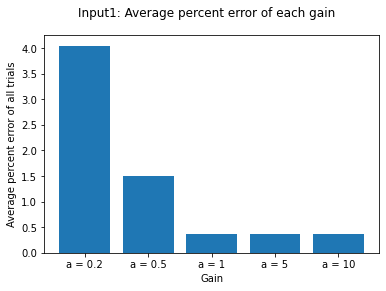 


### **1.2. Input x2 = [1, -1, 1, 1, -0.5, 1]**
**Constant Parameters**
| Input(x) | Weight(w) |
| :---: | :---: |
| <pre>x2 = [1, -1, 1, 1, -0.5, 1]</pre> | <pre>w = [1, -1, 2, -1, 2, -1]</pre> |
**Test Results**
| Gain(a) | Trials | Percent error | Average percent error of 3 Trials |
|--|--|--|--|
|0.2| 100  | -7.82 %  | 3.66 % |
| ↑  | 1000 | 2.51 %  |    ↑     |
| ↑  | 10000|  <span style="color:blue">0.66 %</span> |    ↑     |
|0.5| 100  | -2.04 % |1.44 %  |
| ↑  | 10000| 1.20 %  |    ↑     | 
| ↑  | 1000 | <span style="color:blue">1.07 %</span>  |    ↑     | 
|1  | 100  | -2.97 % | 1.57 % |
| ↑  | 1000 | 1.74 % |     ↑    |
| ↑  | 10000| <span style="color:blue">0.01 %</span> |     ↑    |
|5  | 100  | -2.40 % |0.90 %  |
| ↑  | 1000 | -0.23 % |    ↑     |
| ↑  | 10000| <span style="color:blue">0.07 %</span> |     ↑    |
|10 | 100  | -1.01 % |0.37 %  |
| ↑  | 1000 | -0.10 % |    ↑     |
| ↑  | 10000| <span style="color:blue">-0.02 %</span> |    ↑     |

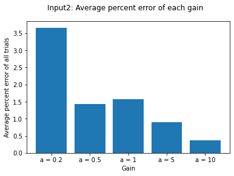  


#### **Summary**
Trials: As the result, the percent error will be minimum when `Trial = 10000`, so we can conclude that **<mark>the more trial, the less error</mark>**.

Gain(a): As the result, the percent error will be minimum when `a = 10`, so we can conclude that **<mark>the more gain, the less error</mark>**.  

For my opinion, this conclusion could not apply for all situations. It may suitable for these set of inputs and weights only.

## **Task 2 - RNN**
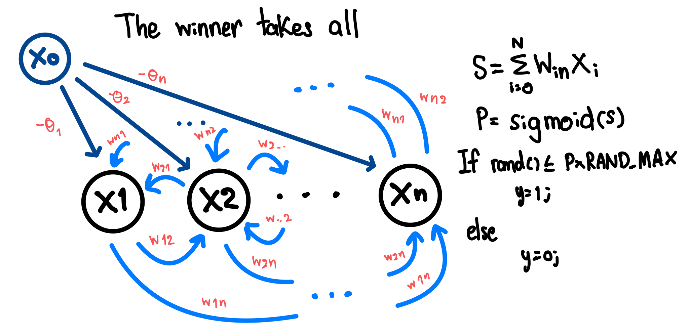 
[Source code](code/task2.py)  
Procedure
1. Make the winner takes all RNN.
1. Use the probabilistic binary model for its neurons.
1. Execute the neuron with parameters defined in table.

### 

### **2.1. Compute the convergent state of neurons**
Set the gain to a large number, so the model will be deterministic. Repeatedly update each neuron until reach the convergent state.  

**Constant Parameters**

| weight(x) | Gain(a) |
| :-------:|:----: |
|<pre>[0,  1,  1,  1], #0<br/>[0,  0, -2, -2], #1<br/>[0, -2,  0, -2], #2<br/>[0, -2, -2,  0]  #3</pre>| 1000 |

**Test Results**

| Input(x) | Convergent state(x) |
| :----: | :-------:|:----: | :-----: |
|<pre>[1, 0, 0, 0]</pre>| <pre>[1, 1, 0, 0]</pre> |
|<pre>[1, 1, 1, 1]</pre>|↑| ↑ | <pre>[1, 0, 0, 1]</pre> |
|<pre>[1, 1, 0, 1]</pre>|↑| ↑ | <pre>[1, 0, 0, 1]</pre> |
⭐x[0], w[0] is dummy

### **2.2. Try with different gain**
Change the gain and see what happen  

**Constant Parameters**

| Input(x) | weight(x) |
| :----: | :-------:|
|<pre>[1, 0, 0, 0]</pre>|<pre>[0,  1,  1,  1], #0<br/>[0,  0, -2, -2], #1<br/>[0, -2,  0, -2], #2<br/>[0, -2, -2,  0]  #3</pre>|

**Test Results**

| Gain(a) | The most existing state (x) | Graph |
|:----: | :-----: | :----: |
| 0.2 | <pre>[1, 1, 0, 0]</pre> |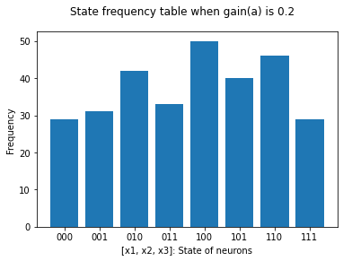|
| 0.5 | <pre>[1, 0, 1, 0]</pre> |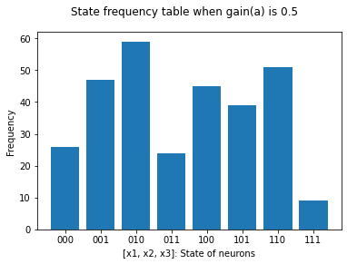|
| 1.0 | <pre>[1, 1, 0, 0]</pre> |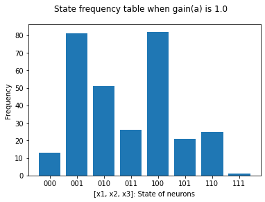|

#### **Summary**
Convergent: When we set a gain to a large number, the model will be deterministic and we can find the convergent state. In the other hand, if we set a gain to a small number, the model will be more stochastic and we can not find the convergent state.  
Gain(a): As the result, the distribution decreases when gain increases. We can conclude that if we want the output to be more deterministic we should increase gain, but if we want the output to be more stochastic, then we should decrease the gain.

## **Task 3 - The Decreasing of Energy**
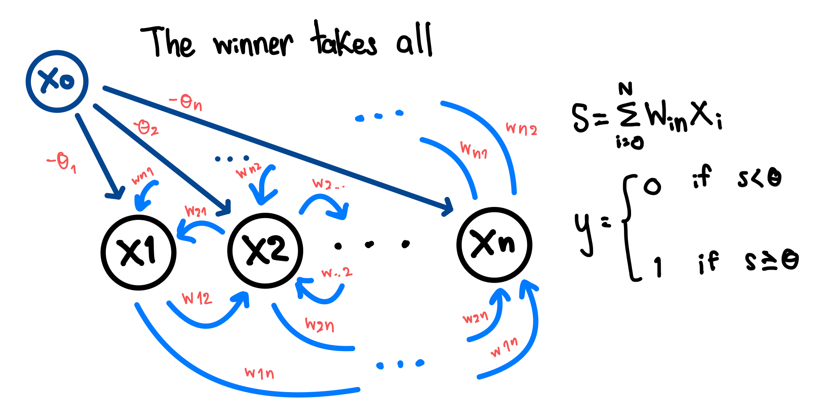  
[Source code](code/task3.py)  
Procedure
1. Make the winner takes all RNN.
1. Use the deterministic binary model for its neurons.
1. Execute the neuron with parameters defined in table.
1. Updating each neuron and record the energy.
1. Change weights and check the changing of the energy.

**Test Results**
#### *<p align='center'> Professor's defined RNN </p>*

| Input(x) | weight(x) | Convergent state(x) |
| :----: | :-------|:----: |
|<pre>[1, 1, 1, 1, 1, 1]</pre>|<font size="2"><pre>[0, 1, 1, 1, 1, 1],#0<br/>[1, 0,-2,-2,-2,-2],#1<br/>[1,-2, 0,-2,-2,-2],#2<br/>[1,-2,-2, 0,-2,-2],#3<br/>[1,-2,-2,-2, 0,-2],#4<br/>[1,-2,-2,-2,-2, 0] #5<br/></pre></font>| <pre>[1, 0, 0, 0, 0, 1]</pre> | 

##### <p align='center'>Energy of the RNN in each updating</p> 
<p align='center'>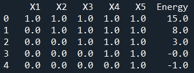</p>


#### *<p align='center'> Author's defined RNN </p>*
| Input(x) | weight(w) | Convergent state(x) |
| :----: | :------- |:----: |
|<font size="1"><pre>[1, 1, 1, 1, 1, 1, 1, 1]</pre></font> |<font size="1"><pre>[0, 1, 1, 1, 1, 1, 1, 1],#0<br/>[1, 0,-2,-3,-4,-2,-3,-4],#1<br/>[1,-2, 0,-4,-5,-6,-1,-2],#2<br/>[1,-3,-4, 0,-1,-2,-3,-4],#3<br/>[1,-4,-5,-1, 0,-1,-2,-3],#4<br/>[1,-2,-6,-2,-1, 0,-1,-2],#5<br/>[1,-3,-1, 3,-2,-1, 0,-1],#6<br/>[1,-4,-2, 4,-3,-2,-1, 0] #7</pre></font> | <font size="1"><pre>[1, 0, 0, 1, 1, 0, 0, 0]</pre></font> |

##### <p align='center'>Energy of the RNN in each updating</p> 
<p align='center'>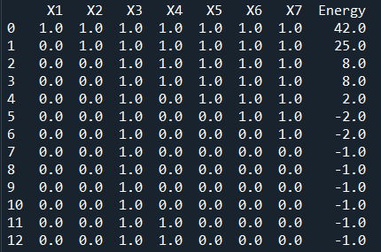</p>

#### **Summary**
As the result, the energy of RNN always decreases when the neuron updates its state. The convergence state will has a minimum energy. 

## **Task 4 - RNNs with Boltzmann's Distribution**
[Boltzmann's Distribution](https://en.wikipedia.org/wiki/Boltzmann_distribution) is can be used measure the number of molecules that have their energy between some amounts of energy. This distribution can be applied to many things included RNN. Gibbs copies is the technique to makes copies of the same RNN.
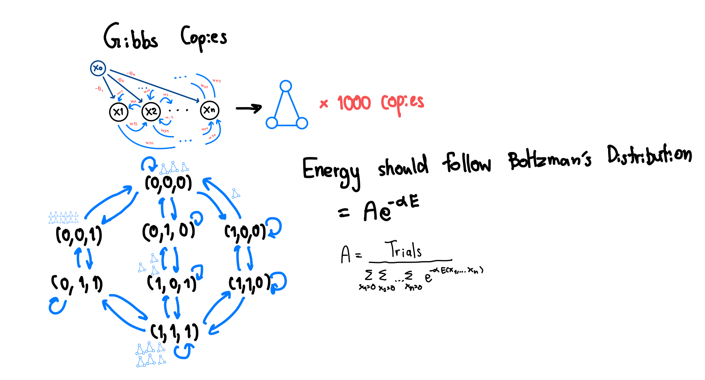  
[Source code](code/task4.py)

### **4.1. Boltzman's distribution**
Procedure
1. Make a copy of RNN
1. Update the state of neuron 1 by 1 for each copy
1. The experimental result: Collect the number of copies in each state
1. The theoretical result: Caculate follows Boltzman's distribution for all possible states.

#### **Constant Parameters**
| Input(x) | weight(w) |
| :----: | :-------|
|<font size="2"><pre>[1, 1, 1, 1, 1, 1]</pre></font> |<font size="2"><pre>[0,  1,  1,  1,  1,  1],#0<br/>[1,  0, -2, -2, -2, -2],#1<br/>[1, -2,  0, -2, -2, -2],#2<br/>[1, -2, -2,  0, -2, -2],#3<br/>[1, -2, -2, -2,  0, -2],#4<br/>[1, -2, -2, -2, -2,  0] #5</pre></font> |

#### **Test Results**
#### ***<p align="center">Energy table: To shows the energy in each state</p>***

| # of Trials | # of Copies | Gain(a) | Energy table
| :---- | :------- | :------- | :----: |
| 1000 | 1000 | 0.5 |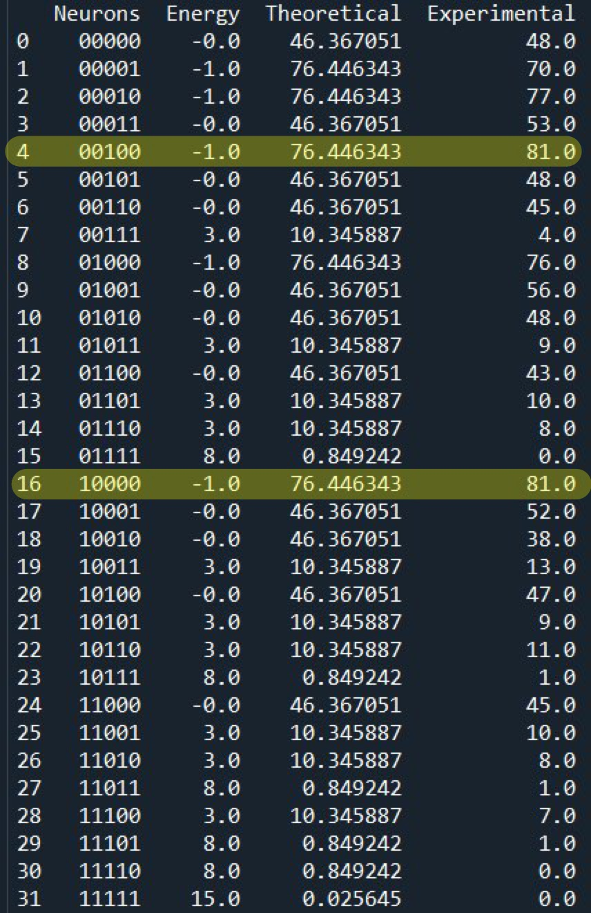 
#### ***<p align="center">Distribution graph: To compare the theoretical and the experimental result</p>***

| # of Trials | # of Copies | Gain(a) | Distribution graph
| :---- | :------- | :------- | :----: |
| 100 | 100 | 0.5 | 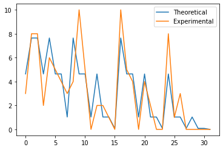 
| 100 | 1000 | 0.5 |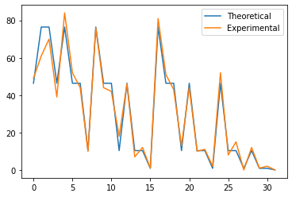 
| 1000 | 1000 | 0.5 |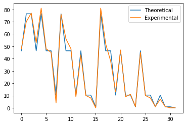 
| 1000 | 1000 | 0.2 |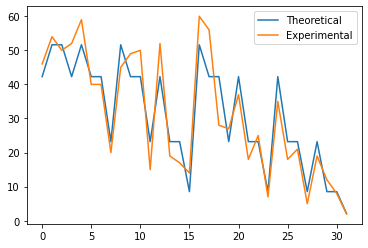 
| 1000 | 1000 | 1.0 |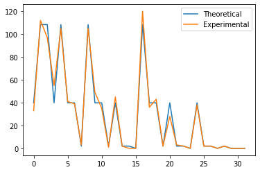 
| 1000 | 1000 | 1.5 |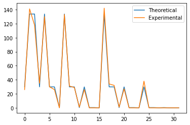

#### ***<p align="center">Try with author's RNN defined in Task 3</p>***
| # of Trials | # of Copies | Gain(a) | Distribution graph
| :---- | :------- | :------- | :----: |
| 100 | 1000 | 0.5 |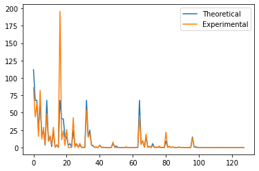 

<p align='center'></p>

#### **Summary**
As the result, the experimental result and the theoretical result is going to the same way. When we increase the number of copies, the result is more closer. The increasing of the number of trials also effects the result, but it not that much.  
The Changing of gain also effects to the result. The more gain makes the result closer, but the distribution of result will be decreased.  
For my opinion, the most suitable parameters is ``` Trials = 1000, Copies = 1000, Gain = 0.5```  
As the result of energy, the most of experimental result will have the lowest energy. Thus, we can predict the equilibrium state from an energy. If the energy is low, it is more likely to be equilibrium state.
### **4.2. Equilibrium**
#### Procedure
1. Make a copy of RNN.
1. Update the state of neuron 1 by 1 for each copy.
1. Collect the state of each copy.
1. Repeatedly update until the major copies stop to change their state.

#### **Constant Parameters**
| Input(x) | weight(w) | # of Trials | # of Copies |
| :----: | :-------| :------- | :----: |
|<font size="2"><pre>[1, 1, 1, 1]</pre></font> |<font size="2"><pre>[0,  1,  1,  1],#0<br/>[1,  0, -2, -2],#1<br/>[1, -2,  0, -2],#2<br/>[1, -2, -2,  0],#3<br/></pre></font> | 100 | 1000|

#### **Test Results**
| Gain(a) | # of copy in each state | ⭐The state changing of each copy in each trail |
| :---- | :-------: | :-------: |
| 0.1 | 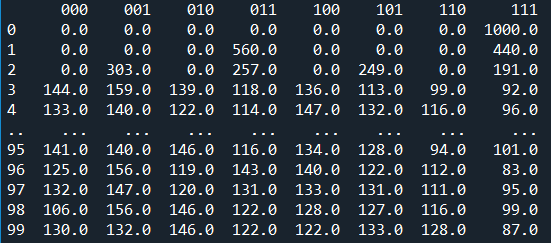 | 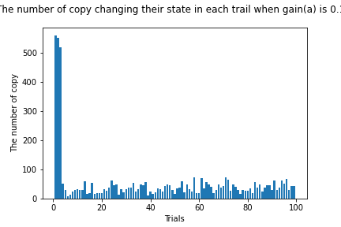 |
| 0.5 | 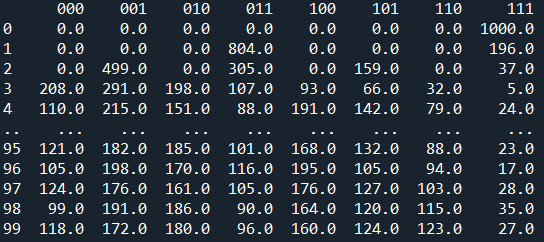 | 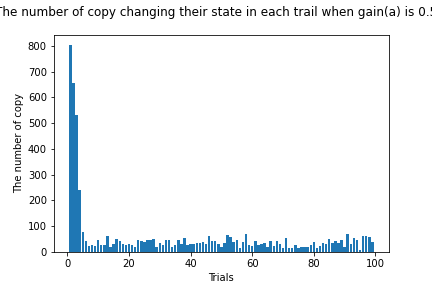 |
| 1.0 | 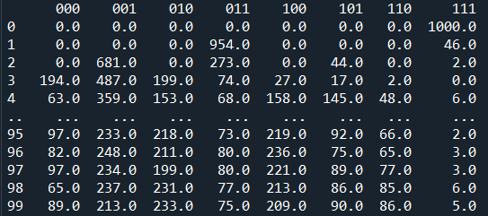 | 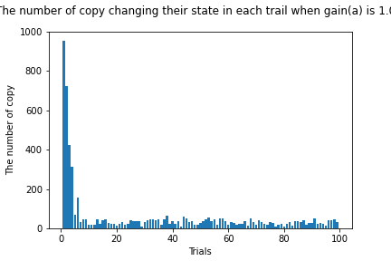 |
| 5.0 | 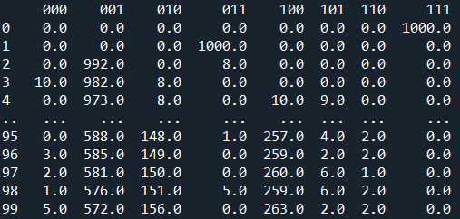 | 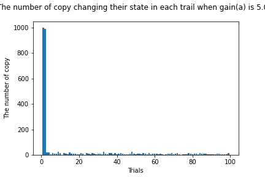 |

⭐ This value shows the number of copy which changes to the new state. 

#### **Summary**
As the result, many copies change their state in the starting time. After updating around 10-20 times, the number of changing decreases a lot. After that, this number just changes a little bit. Thus, we can conclude that when this number is not changed too much comparing to previous times, then this system reaches the equilibrium.  
The increasing of gain makes copies less state change.

## **Task 5.1 - Ergodicity**
Due to the Gibbs copies method consumes a lot of memory, Ergodicity has been publish. We can use a time series of states generated by a single RNN, instead of the states of Gibbs copies.  
Procedure
1. Ergodicity result: Make 1 RNN and repeatedly update and collect the state of RNN in each time
1. Experimental result(Gibbs copies): Use Gibbs copies RNN from task 4
1. Compare result: the theoretical result vs the experimental result vs the Ergodicity result
[Source code](code/task5.py)

### *Adjust Gain: To check the result of Ergodicity when gain is changed*

#### **Constant Parameters**
| Input(x) | weight(w) | # of Trials | # of copies
| :----: | :-------| :---: | :---: |
|<font size="2"><pre>[1, 1, 1, 1, 1, 1]</pre></font> |<font size="2"><pre>[0,  1,  1,  1,  1,  1],#0<br/>[1,  0, -2, -2, -2, -2],#1<br/>[1, -2,  0, -2, -2, -2],#2<br/>[1, -2, -2,  0, -2, -2],#3<br/>[1, -2, -2, -2,  0, -2],#4<br/>[1, -2, -2, -2, -2,  0] #5</pre></font> | 1000 | 1000

#### **Test Results**
| Gain(a) | the theoretical result vs the experimental result vs the Ergodicity result |
| :---- | :-------: |
| 0.1 | 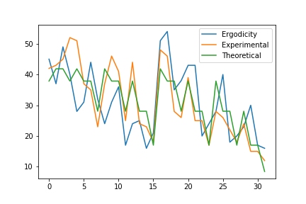
| 0.5 | 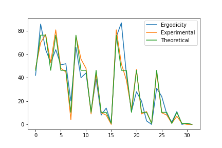
| 1.0 | 
| 5.0 | 

### *Adjust the number of trials and copies: To check the result of Ergodicity when trials and copes are changed*

#### **Constant Parameters**
| Input(x) | weight(w) | Gain |
| :----: | :-------| :---: |
|<font size="2"><pre>[1, 1, 1, 1, 1, 1]</pre></font> |<font size="2"><pre>[0,  1,  1,  1,  1,  1],#0<br/>[1,  0, -2, -2, -2, -2],#1<br/>[1, -2,  0, -2, -2, -2],#2<br/>[1, -2, -2,  0, -2, -2],#3<br/>[1, -2, -2, -2,  0, -2],#4<br/>[1, -2, -2, -2, -2,  0] #5</pre></font> | 0.5

#### **Test Results**
| # of Trials | # of copies | the theoretical result vs the experimental result vs the Ergodicity result |
| :---- | :-------: | :---: |
| 100 | 100 |
| 1000 | 1000 |
| 10000 | 10000 |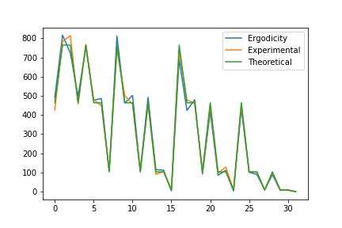

#### **Summary**
As the result, the Ergodicity can be replaced the Gibbs copies if we have a good parameter tuning.  
For the Gain tuning, the lower gain makes the oscillated result, so 3 results are going to different ways. The more gain makes the result too determined. As we can see, when the gain is 5, only the Ergodicity result is not compatible. The suitable gain should be 0.5  
For trials and copies tuning, the higher number makes the result better.

## **Task 5.1 - Application**
An application of RNN solves the simultaneous equation.  

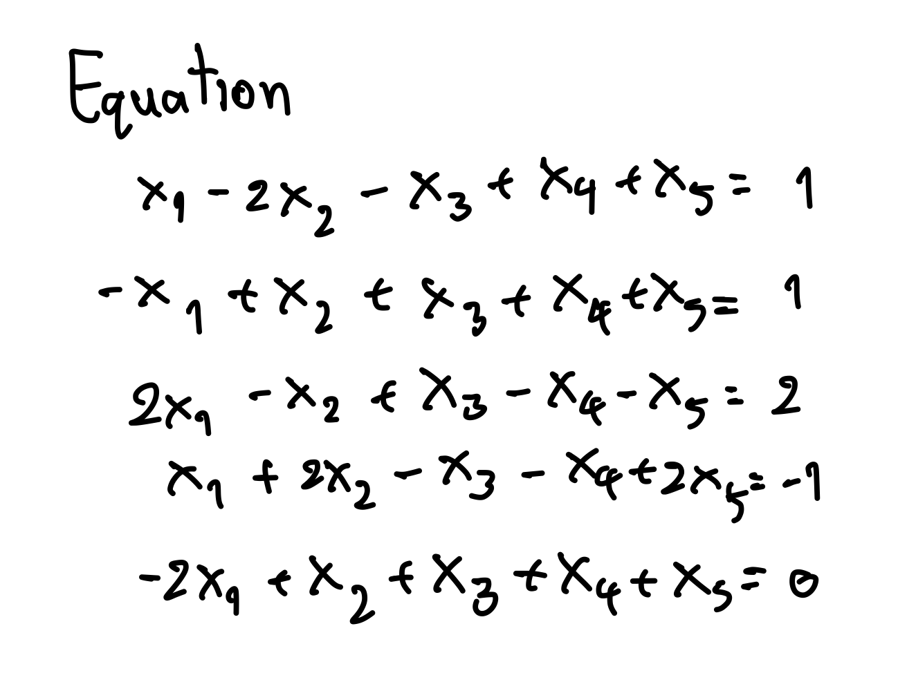

Procedure
1. Construct an energy function with the standard for, so that its minimum is the solution of the simultaneous equation.  
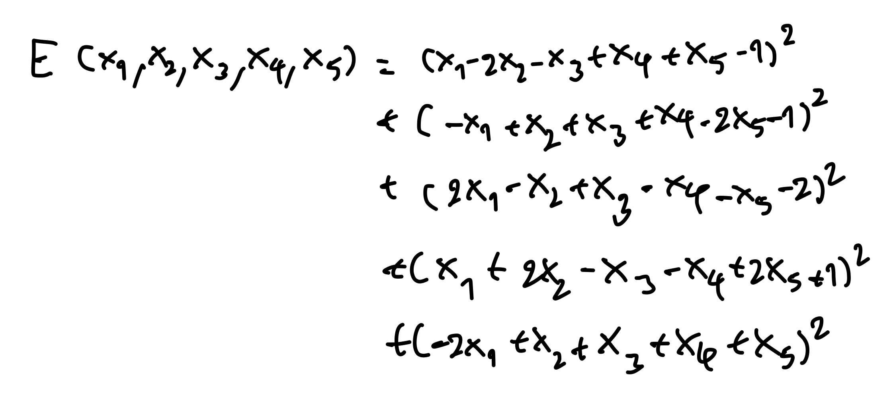
1. Expand this equation nad get the standard form.
1. Get all weight and theta values from standard equation. Don't forget Wnm = Wmn, so the weight array need to be adjusted.  
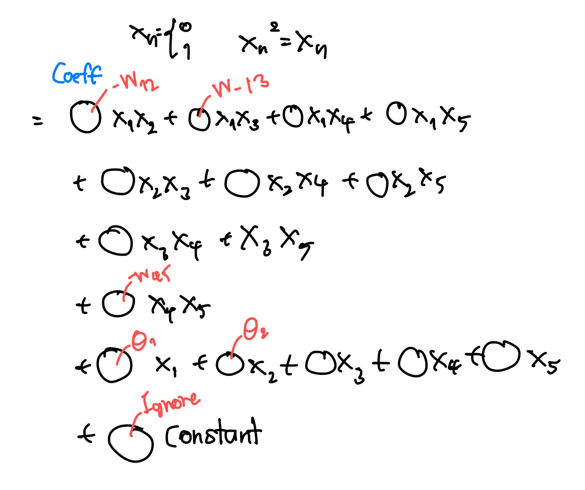
1. Create the RNN with this weight.
1. Repeatedly update. The most frequently appeared state is the solution

[Source code](code/task5.py)

| Input(x) | weight(w) | # of Trials | # of copies |
| :----: | :-------| :-------: | :---: |
|<font size="2"><pre>[1, 1, 1, 1, 1, 1]</pre></font> |<font size="2"><pre>[  0. ,  -2.5, -10.5,   0.5,  -1.5, -10.5],#0<br/>[ -2.5,   0. ,   5. ,   3. ,   5. ,  -1. ],#1<br/>[-10.5,   5. ,   0. ,   1. ,   1. ,  -2. ],#2<br/>[  0.5,   3. ,  -1. ,   0. ,   1. ,   5. ],#3<br/>[ -1.5,   5. ,   1. ,  -1. ,   0. ,   1. ],#4<br/>[-10.5,  -1. ,  -2. ,   5. ,   1. ,   0. ] #5</pre></font> | 1000 | 1000

| Gain (a) | Solution[X1, X2, X3, X4, X5] | The frequency table of each result | Graph |
| :----: | :-------: | :-------: | :---: |
| 0.1 | [1, 0, 1, 1, 0] | 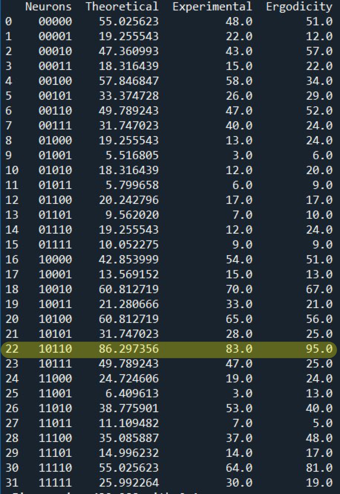 | 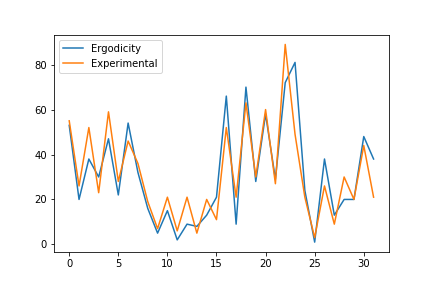
| 0.5 | ↑ | 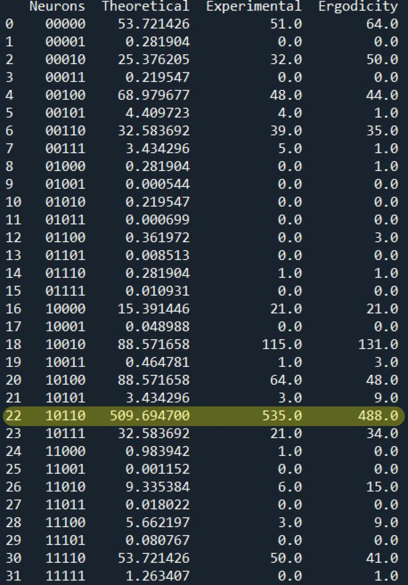 | 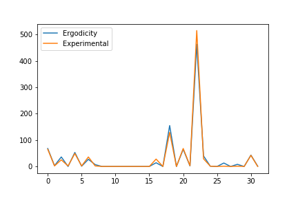
| 1.0 | ↑ | 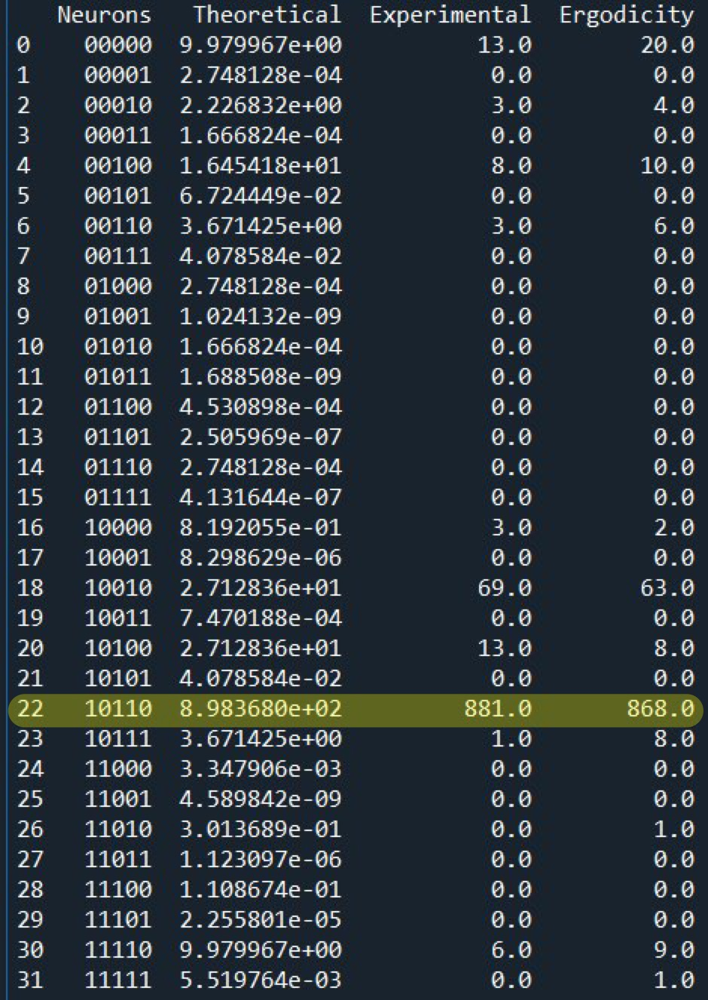 | 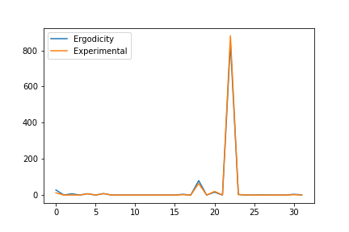

#### **Summary**
As the result, we can use the RNN method to find the solution of the simultaneous equation. All of method whether a theoretical, Gibbs copies, Ergodicity can get the correct result. The more gain makes more confident of the result, but we can get the correct result from all gains.

---
## **Author**
Nithid Mahattanasin 6314552737 student of TAIST AI&IoT (ICTES) course 2020, Kasetsart University